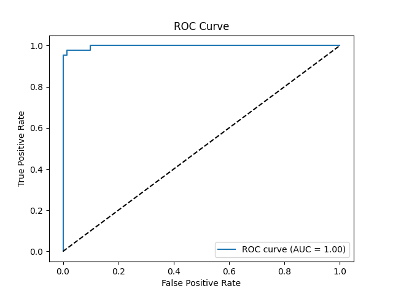

# Logistic Regression - Binary Classification (Breast Cancer Dataset)

## 📌 Task Overview
This project is part of **Task 4** for the AI & ML Internship.  
The objective is to **build a binary classifier** using **Logistic Regression** and evaluate it with multiple performance metrics.

---

## 📂 Dataset
I used the **Breast Cancer Wisconsin Dataset** from UCI/Kaggle.  

- **Target variable:** `diagnosis` (M = Malignant, B = Benign)  
- **Features:** 30 numerical measurements of cell nuclei  
- **Shape:** 569 rows × 32 columns (after cleaning: 569 × 31)  

**Dataset Link:**  
[Breast Cancer Wisconsin Dataset - Kaggle](https://www.kaggle.com/datasets/uciml/breast-cancer-wisconsin-data)  

---

## ⚙️ Steps Performed
1. **Data Loading & Cleaning**
   - Dropped unnecessary columns: `id` and `Unnamed: 32`
   - Encoded `diagnosis`: M → 1, B → 0

2. **Train/Test Split**
   - 80% training, 20% testing

3. **Feature Scaling**
   - Standardized features using `StandardScaler`

4. **Model Building**
   - Logistic Regression with `scikit-learn`

5. **Evaluation Metrics**
   - Confusion Matrix
   - Precision & Recall
   - ROC-AUC Score
   - ROC Curve Plot
   - Threshold Tuning


## 📊 Example Output

=== Model Evaluation ===
Confusion Matrix:
[[71 2]
[ 1 40]]
Precision: 0.952
Recall: 0.976
ROC-AUC: 0.995


---

## 📈 Visualizations
**ROC Curve**  
[](plots/roc_curve.png)


---

## 📦 Requirements
```bash
pip install pandas numpy scikit-learn matplotlib

